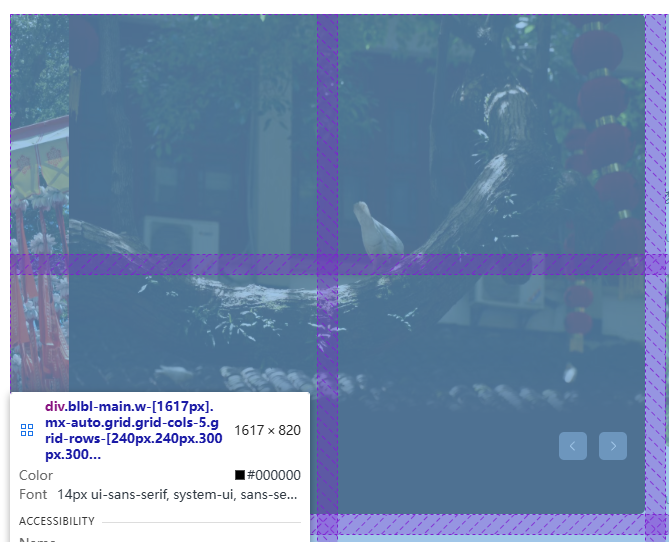

1、实现b站，而且数据要用json，模拟ajax调用。
2、这个调用应该是在主页向下滑动加载出来新的东西之后需要用ajax来发送数据
3、然后观察主页，明显是有媒体查询然后改变布局的
4、先用html+css搞定基本布局


### 引入网站图标
使用这样一行类型是icon的链接，然后图片地址写成对应的地址
`<link rel="icon" href="./img/blbl.ico">`
### 用express去建立一个本地的服务器
使用`npm i express`安装好express框架
构建出express的基本结构 
```
//1、引入express
const express = require('express');
//创建应用对象
const app = express();
//3、创建路由规则
//request是对请求报文的封装
//response是对响应报文的封装
app.get('/', (request, response) => {

    response.send('hello Ajax');
});
//4、监听端口启动服务
app.listen(8000, () => {
    console.log("服务器已经启动,8000端口监听中...");

})
```
### 使用nodemon启动服务器，实时改变服务器的状态和变化
`npm install -g nodemon`安装
`nodemon server.js`启动服务器端
启用之后，服务器会自动刷新更改

### 使用tailwindcss4
构建流程：

* 注意html中引入的是output.css

### git提交和同步的准备
使用vs自带的git工具，创建库之后，提交。注意的是我在github上已经创建了库，所以治理使用远程去选取库而不是创建一个新的库


## html+css
总体的html分为三部分：头部、分类区、主体区

### 1.头部也分为左中右三个部分，左边和右边的功能类似，中间部分则是搜索框。同时整个头部在滚动到一定范围之后需要作为fixed定位。左右两边分区需要使用定位来实现一些下拉框效果。中间的搜索框，我的想法是简单的把输入的数据发送到服务端，让服务端经过一些处理之后，再发送回来
服务端：
```
app.use(express.text());
//创建一个处理数据的路由规则
app.post('/search', (req, res) => {
    console.log('收到搜索请求');
    res.setHeader('Access-Control-Allow-Origin', '*');
    //用req来读取一个接受过来的信息
    console.log(req.body);
    //发送的纯字符串请求


    const textData = JSON.stringify(chooseArr(req.body, textArr));


    //返回什么数据？10条有关信息，把req.body的每个字符拆开来，去textArr里面寻找
    res.send(textData);
})

function chooseArr(str, arr) {
    const dataSet = new Set();
    let charArr = str.split('');

    for (let index = 0; index < charArr.length; index++) {
        for (let j = 0; j < arr.length; j++) {
            if (arr[j].includes(charArr[index])) {
                dataSet.add(arr[j]);
            }

        }

    }
    const dataArr = Array.from(dataSet)


    return dataArr;
}
```
### 2.分类区

第一次使用grid布局，感觉还不错，不过这里是写在原生css里卖弄的，后面我再改到tailwindcss里面

### 3.主内容

使用grid布局，然后轮播图是跨行跨列
下方的主要内容，我的想法是，页面滚动到一定位置再发送ajax请求JSON数据转换成对象再实现一个加载，这个好像就是懒加载？

### 3.Grid布局
#### 1、基础用法是在开启grid布局之后进行一个位置的设置如
`grid-template-columns: repeat(5,100px);`
给父容器加上这个之后，会发现子元素的宽度都是100px，并且按照5个一行排列起来。同时可以使用grid的专用单位 *fr*来设置
`grid-template-columns: repeat(5,1fr);`
*fr*表示父容器中剩余宽度，像这里*1fr*重复5次那就表示讲父容器自动平分为5份
#### 2、gap
gap表示grid布局中的间距
有`gap : 10px`这样的直接设置左右间距和上下间距的
也可以细分为`gap-rows:10px`和`gap-cols:20px`  设置不同的宽度和高度间距
#### 3、行列数
当开启grid布局的父容器是固定大小，可能需要规划行列的数量比如3*5
可以这样实现：`grid-template-columns: repeat(5,1fr);`和`grid-template-rows: repeat(3,1fr);`
这样就自动划分成了3x5， *col*是横向上的一行 *row*是纵向上的一列
当父容器有需求，比如在这里，前两行需要240px，而后面每一行全部是300px。那在行的设置上可以不用*fr*转而使用*px*
如：`grid-rows-[240px 240px 300px 300px]`
同时在这里，后面使用ajax获取数据再向后面插入的时候，因为后面没有设置高度，**所以插入的元素需要自己设置高度**
#### 4、跨域
比如我们里每行划分的是5个元素，但是轮播图是需要2x2这样一个大区域的

那这个怎么实现呢？
```
.blbl-main .lunbo {
    grid-area: 1/1/3/3;
}
```
**grid-area** 从索引区域1链接到索引区域3
同时，这里不是占用了两份空间么，一份高度确定的情况下，轮播图的总高度需要设置为500px（240*2+20）.这样才会正常显示跨域

### mask-image
因为轮播图的整体实现是图片下方有遮盖渐变效果，所以要使用mask-image
我也不是很清楚这个的特效是个什么用法，但是在这里只是用到了这一个属性mask-image:linear-gradient
```
.image-container img {
    height: 500px;
    width: 100%;
    
    /* 使用了flex会导致图片自动收缩 */

    flex: none;
    mask-image: linear-gradient(
        to top,
        transparent 0%,     /* 底部完全透明 */
        transparent 20%,    /* 保留20%给文字区域完全透明 */
        black 30%,          /* 21%处开始渐变到不透明 */
        black 100%          /* 其余部分完全不透明 */
    );
    
    /* flex这个有三个值，直接控制伸长收缩和 */
}
```
结构是这样，容器包含着图片以及和图片并级的下方信息，接着让图片充满容器之后，使用这个属性。下方的信息则设置好宽高后使用绝对定位把位置定位到这个遮罩层上

### 取色
因为我看到b站上的轮播图，下面的背景颜色是会随着图片的变化而改变的，而且都是图片下方的大致颜色
这里直接说依稀去啊实现方法吧。
先创建一个绘画版元素，然后获取到你要取色的元素，把它加载到取色板上面就能取到rgb颜色
```
function getBottomAverageColor(img) {
            const canvas = document.createElement('canvas');
            const ctx = canvas.getContext('2d');

            canvas.width = img.naturalWidth;
            canvas.height = img.naturalHeight;
            ctx.drawImage(img, 0, 0);

            // 取底部20%的区域
            const bottomHeight = Math.floor(canvas.height * 0.2);
            const imageData = ctx.getImageData(
                0,
                canvas.height - bottomHeight,
                canvas.width,
                bottomHeight
            );

            const data = imageData.data;
            let r = 0, g = 0, b = 0, count = 0;

            // 采样计算平均值
            for (let i = 0; i < data.length; i += 16) {
                r += data[i];
                g += data[i + 1];
                b += data[i + 2];
                count++;
            }

            return [
                Math.floor(r / count),
                Math.floor(g / count),
                Math.floor(b / count)
            ];
        }
```
### 滚动加载事件
* 这个也许叫做“懒加载”？我的想法是现在加载可视区域的内容，当你滚动到下面的时候，发出ajax请求并且插入数据。执行起来也很简单。设置几个变量：1：body的总长  2：scrollTop：表示已经卷去了多少  3：视口的高度
当body的总长减去scrollTop 小于视口的高度的时候，不就表明“哎呀，我的展示内容已经到这里了，再往下翻也没啦”。所以这个时候，发送请求插入新的视频元素
同时这样body的总长也在增加，所以可以一直滚动下去

#### 同时我发现了非常神奇的点：如果你的页面缩小了，会出现 *整个页面完全能直接容纳下body的总高度*的情况，嗐这个时候，滚动条都不出现了，滚动条不出现可不行啊，我绑定的事件可视滚动事件呢。这样下去难不成不能加载了？
解决方法是想到了，在页面刚开始加载的时候我就加一个判断，当我的body总长小于视口的总长的时候，我直接来一个加载，而且加个判断直到我的body长度超过视口长度加载停止
但是碰到了问题，那就是我对这个高度的理解没有到位啊，我错把`document.documentElement.scrollHeight`当成了这个body容器的高度，所以除了很多乱子，比如我以为问题出在异步任务的判断，然后写了乱七八糟的函数
不过现在问题解决了，我们来看区别
* document.documentElement.scrollHeight：获取的是html的高度
* document.body.scrollHeight：获取的是body的高度
* window.innerHeight：获取的是视口的高度
* 如果你的body高2000，视口高960，此时html高度会是2000！因为html就是你内容的高度
* 如果你的body高2000，视口高2100，此时html高度会是2100！html和视口高度一致了
* 浏览器缩放的原理其实就是保持body的高度不变，变大了视口，然后再按比例缩小，所以会出现，缩小之后，视口变大从而使这里的html的高度和视口大小一样的情况

### url解析
实现详情页面的时候，需要只做一个详情页，然后根据不同的视频来渲染视频。那想法就是，视频的地址是存在服务器里面的，在首页点击视频的时候，视频的链接里应该传入视频的特殊参数比如videoId，然后通过解析url参数再向服务器发送带着参数的ajax请求，渲染视频
关键就是url解析，其实也简单
1、传递url参数，使用键值对方式，用"?"隔开与前面的链接 `./video.html?videoId=6`
2、使用URLSearchParams解析，创建对象，传入url.search,再使用get方法获取到值
```
let currentUrl = new URLSearchParams(window.location.search);
        console.log(currentUrl.get('videoId'));//这里面要使用字符串！！！
        let id = currentUrl.get('videoId');
```
获取之后，就能使用了
# 注意
1、在JavaScript中直接操作style属性时，属性名需要使用驼峰命名法，而不是CSS中的短横线命名法。比如`background-color`变成了`backgroundColor`